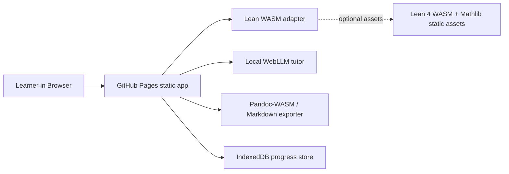

# Lean Theorem Playground

[](https://baditaflorin.github.io/lean-theorem-playground/)
[](https://github.com/baditaflorin/lean-theorem-playground)

Browser-based Lean 4 playground with Mathlib-flavored exercises, local AI tutoring, and proof-to-document export.

Live site: https://baditaflorin.github.io/lean-theorem-playground/
Repository: https://github.com/baditaflorin/lean-theorem-playground
Support: https://www.paypal.com/paypalme/florinbadita

## Quickstart

```bash
npm install
make install-hooks
make dev
make test
make build
```

## What It Does

Lean Theorem Playground is a static GitHub Pages app for learning the path from mathematical intuition to Lean-style formal proof. It ships a proof workbench, five Mathlib-oriented starter exercises, a local WebGPU LLM tutor option through WebLLM, IndexedDB progress persistence, and Markdown/HTML export with a Pandoc-WASM attempt plus a deterministic browser fallback.

## Architecture



Architecture notes: https://github.com/baditaflorin/lean-theorem-playground/tree/main/docs

## Current Kernel Status

The app is Mode A and has no runtime backend. The Lean integration is written behind a browser adapter that can load static Lean 4 WASM artifacts when they are provided under `public/lean/`. The published v0.1.0 includes deterministic proof diagnostics for the bundled exercises so the learning loop works immediately on GitHub Pages while the official browser-library Lean 4 + Mathlib path continues to mature.

## Local Hooks

```bash
make install-hooks
```

Hooks run formatting, linting, typechecking, gitleaks, tests, build, and smoke checks locally. There are no GitHub Actions in this project.

