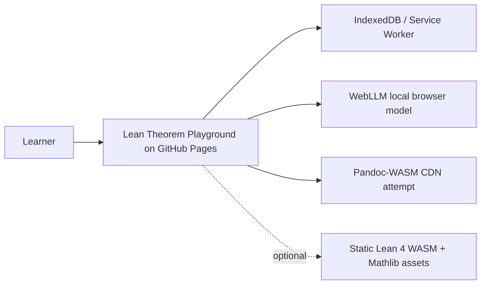
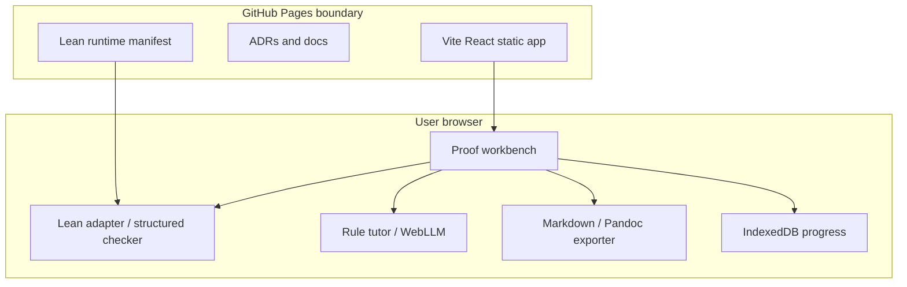

# Architecture

Live URL: https://baditaflorin.github.io/lean-theorem-playground/

Repository: https://github.com/baditaflorin/lean-theorem-playground

## C4 Context

## Container Diagram

## Boundaries

No runtime backend exists. All user code and proof drafts stay in the browser unless the user exports them manually.
